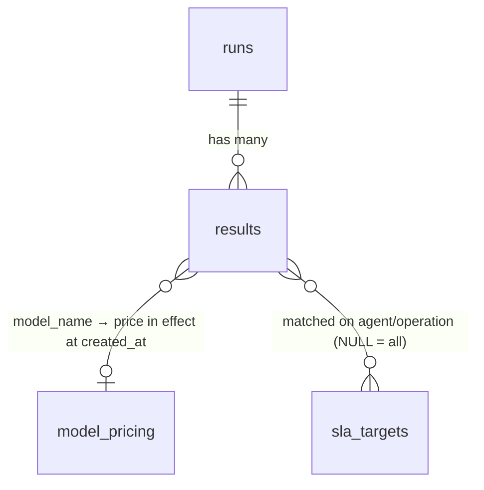

# LLM Operations Benchmark

This project benchmarks the **LLM** behind each of the four agents in
`revinci-ai-agents-demo-bundle`: IT Ops, HR, Sales and Data Analysis. It tests
two capabilities:

- **Query building:** turning a natural-language message into the right tool
  call.
- **RAG:** answering correctly from what the tool actually retrieved.

Each agent is tested on operations built around its **own** tools,
parameters and knowledge base, rather than one generic list applied to all
four. Every test case is a real `/chat` call to a running agent. A separate
judge LLM grades each reply against a written rubric, and all results are
saved to a SQLite database for rankings, SLA checks and cost reports.

**Contents**

1. [What's tested](#whats-tested)
2. [How a benchmark run works](#how-a-benchmark-run-works)
3. [Grading](#grading)
4. [Setup](#setup)
5. [Running from the command line](#running-from-the-command-line)
6. [Service APIs](#service-apis)
7. [Containerization](#containerization)
8. [Data model](#data-model)
9. [Comparing models and runs](#comparing-models-and-runs)
10. [Files](#files)
11. [Extending it](#extending-it)

---

## What's tested

Every agent is tested on the same four operations, filled in with that
agent's own tools, parameters and data:

| # | Operation | Capability |
|---|-----------|------------|
| 1 | **Search query formulation** (plus category filter selection, where the agent's search tool has a filter) | Query building |
| 2 | **Entity/parameter extraction for structured calls** | Query building |
| 3 | **Grounded generation from retrieval** | RAG |
| 4 | **No-match / low-relevance handling** | RAG |

**4 agents × 4 operations × 3 cases = 48 cases per run.**

- **Query building** checks that the agent picks the right search terms and
  the right category or filter. It also checks that the agent resolves the
  right entity (a lead, segment, service or location) from a partial or
  informal reference, and extracts any sub-parameter correctly, such as a
  runbook ID from a search result, a specific month or a process type.
- **RAG** checks that the final answer only uses retrieved content, with no
  invented figures, names or steps. When nothing relevant is found, the
  agent should say so rather than force-fit a weak match or guess.

### What's tested per agent

| Agent | Port | Search tool | Operation 2 tests |
|---|---|---|---|
| **IT Ops** | 8101 | `search_knowledge_base(query)`. It has no category filter, so operation 1 tests query specificity only | The right ticket `category` (Email, Network, Print, …) and the right `service` key (vpn, email, software_center, intranet, identity) for a status check |
| **HR** | 8102 | `search_hr_policy(query, category)`, with categories Leave, Benefits, Conduct, Compensation and General | The right `process` key (e.g. `onboarding`) with the correct subject, date and employment type, and a real location passed to `get_location_guidelines` |
| **Sales** | 8103 | `search_playbook(query, category)`, with categories ICP, Pricing, Competitive, … | Resolving a partial lead name (e.g. "Helio" → Helio Freight) and picking the `sequence` type that fits the situation (trial-activation, inbound-demo or nurture) |
| **Data Analysis** | 8104 | `search_analytics_kb(query, category)`, with categories Methodology, Reporting, Limitations, … | Resolving a segment name and parsing a specific period (e.g. "back in July" → `2026-07`) instead of defaulting to the latest month |

---

## How a benchmark run works

This project and `revinci-ai-agents-demo-bundle` are separate codebases, and
neither imports code from the other. They connect only over plain HTTP,
through the same `/chat` endpoint the demo bundle's own UI uses. The
`AGENTS` setting in [config.py](config.py) maps each agent name to its URL.

```
datasets/<agent>/*.json
        │  runner.load_datasets()
        ▼
  runner.run_case() ──POST /chat──► agent (its own process and LLM)
        │                             picks a tool → queries its KB → writes a reply
        │ ◄── {response, model, tokens, response_time_ms}
        ▼
  judge.rubric_score(message, rubric, response) ──► judge LLM ──► {score, reasoning}
        │
        ▼
  db.insert_result() ──► benchmark.db  (one row per case, written immediately)
        │
        ▼  when the run ends
  report.save() ──► results/raw_<ts>.json + results/summary_<ts>.csv
```

1. **Check the agents.** `agent_client.health_check_all()` calls `GET /health`
   on all four agents. If any is down, the run stops before it starts, so a
   dead agent can't silently score 0 on every case.
2. **Reset demo state.** `agent_client.reset_all()` calls `POST /demo/reset`
   on each agent, so records left over from earlier runs don't affect the
   results. Skip this with `--no-reset` (CLI) or `?no_reset=true` (API).
3. **Load the cases.** `runner.load_datasets()` reads every `.json` file
   under `datasets/`.
4. **Send each case.** A single-turn case (`message`) is one `/chat` call on
   a fresh session. A multi-turn case (`messages`) sends each message in
   order on one session. Tokens and latency are summed across all turns.
5. **Inside the agent.** The agent picks a tool and its parameters, runs it
   against its knowledge base or demo state, and writes a reply. The
   benchmark doesn't see any of this. It only sees the final `/chat` JSON.
6. **Grade.** The judge LLM scores the reply against the case's rubric.
7. **Store.** Each scored case is written to `benchmark.db` straight away,
   so a crash partway through doesn't lose the cases that already finished.
   When the run ends, it is marked finished (or marked with an error), and a
   JSON and CSV snapshot is saved to `results/`.

---

## Grading

Every case is graded by the judge LLM against a plain-English rubric in
`judge.rubric_score()`. For example: *"Names only customers that are
actually in the retrieved approved reference list for fintech… does not
invent a customer name or outcome figure not in the retrieved content."*

- There's no string matching. The judge reads the input, the rubric and the
  answer together, like a human grader would, and returns
  `{"score": 0.0–1.0, "reasoning": "..."}`.
- **A score of 0.5 or higher counts as a PASS.**
- Operations 1 and 2 (query building) are graded **indirectly**. The judge
  never sees the actual tool call. It only sees whether the final answer
  reflects the right entity, category or date.
- If the agent call fails, the case scores `0` with
  `reasoning = "agent call failed: ..."`. If the judge call fails, it scores
  `0` with `reasoning = "judge call failed: ..."`.

**Choosing the judge.** Set `JUDGE_PROVIDER` and `JUDGE_MODEL` in `.env`.
These override the `judge` block in `models.json`. The supported providers
are `openai`, `anthropic`, `gemini`, `together` and `azure_openai` (for
Azure, `JUDGE_MODEL` is the deployment name). The judge's name and model are
recorded on every run.

---

## Setup

```powershell
python -m venv .venv
.venv\Scripts\Activate.ps1
pip install -r requirements.txt
copy models.example.json models.json      # judge fallback, used when JUDGE_* isn't set in .env
```

Create a `.env` file in the project root. It isn't committed to git.

```ini
# Which model grades the benchmark (overrides models.json)
JUDGE_PROVIDER=together            # openai | anthropic | gemini | together | azure_openai
JUDGE_MODEL=zai-org/GLM-5.3-Flash  # for azure_openai, this is the deployment name
# JUDGE_NAME=together-judge        # optional label; defaults to "<model>-judge"

# Only the key for the provider you're using is required
OPENAI_API_KEY=
ANTHROPIC_API_KEY=
GEMINI_API_KEY=
TOGETHER_API_KEY=
AZURE_OPENAI_API_KEY=
AZURE_OPENAI_ENDPOINT=
AZURE_OPENAI_API_VERSION=

# Where the agents run. Use host.docker.internal when running inside Docker.
# AGENT_HOST=localhost
```

Load the reference data (prices and SLA targets) once, and again whenever it
changes:

```powershell
copy pricing.example.json pricing.json          # edit with real rates
copy sla_targets.example.json sla_targets.json  # edit with real targets
python seed_reference_data.py
```

You can safely run `seed_reference_data.py` more than once. It doesn't
create duplicate SLA targets.

---

## Running from the command line

All four agents must already be running (see the demo bundle's README):

```
localhost:8101  it-ops
localhost:8102  hr
localhost:8103  sales
localhost:8104  data-analysis
```

```powershell
python run_benchmark.py              # health check → reset → 48 cases → score matrix
python run_benchmark.py --no-reset   # keep the current demo state
```

After a run, you can query the stored results:

| Command | What it shows |
|---|---|
| `python rankings.py` | Agent leaderboard for the latest run |
| `python rankings.py --by model --all-time` | Which model scored best across every run |
| `python sla_check.py` | Any SLA breaches (**exits non-zero on a breach**, so it can be used as a CI gate) |
| `python costs.py --by model` | Dollars spent per model |
| `python compare_models.py` | How each model scored on the **same** case, side by side |
| `python compare_runs.py` | Difference between the two most recent CSV snapshots |
| `python query_last_run.py [--run N]` | The latest run's results, with the query text |
| `python view_db.py <table> [--run N] [--limit N]` / `--sql "..."` | Raw table contents or any SQL query |

`rankings.py`, `sla_check.py` and `costs.py` all accept `--run <id>` and
`--all-time`. `rankings.py` and `costs.py` also accept `--by agent|operation|model`.

---

## Service APIs

[service.py](service.py) wraps the CLI tools in a FastAPI REST service, so
another system can start a run or read results over HTTP without shell
access.

```powershell
uvicorn service:app --host 0.0.0.0 --port 8000
```

Interactive API docs (Swagger UI) are at **http://localhost:8000/docs**.

### Endpoints

| Method | Endpoint | Query params | What it does |
|---|---|---|---|
| `GET` | `/health` | – | Status of this service, plus whether each agent is reachable |
| `POST` | `/runs` | `no_reset` (bool) | Starts a benchmark run **in the background** and returns `202` immediately with the `run_id` |
| `GET` | `/runs/{run_id}` | – | A run's status (`running` or `finished`), plus its agent rankings once finished |
| `GET` | `/rankings` | `by`, `run_id`, `all_time` | Average score per agent, operation or model, best first |
| `GET` | `/sla-check` | `run_id`, `all_time` | Each active SLA target with its measured value, plus `any_breach` |
| `GET` | `/costs` | `by`, `run_id`, `all_time` | Dollar cost and token totals per agent, operation or model |

**Scope parameters (the same on every read endpoint):**
- `by`: `agent` (default), `operation` or `model`.
- `run_id=N`: results for that run only.
- `all_time=true`: results from every stored run.
- Neither: the **latest** run.

### Error responses

| Code | When |
|---|---|
| `400` | `by` isn't one of `agent`, `operation` or `model` |
| `404` | The run ID doesn't exist, or no runs are stored yet |
| `409` | `POST /runs` while another run is still in progress (a `runs` row with no `finished_at`) |
| `503` | `POST /runs` while one or more agents are unreachable |

### Examples

```bash
# Start a run
curl -X POST http://localhost:8000/runs
# → {"run_id": 28, "status": "started"}

# Check on it (a full run takes about 30–40 minutes)
curl http://localhost:8000/runs/28
# → {"id": 28, "started_at": "...", "finished_at": null, "judge_name": "together-judge",
#    "judge_model": "zai-org/GLM-5.3-Flash", "notes": "", "status": "running"}
# Once finished, it also includes "rankings": [{"name": "hr", "avg_score": 0.92, "n": 12}, ...]

# Model leaderboard across all runs
curl "http://localhost:8000/rankings?by=model&all_time=true"
# → {"scope": "all-time", "rankings": [{"name": "zai-org/GLM-5.3-Flash", "avg_score": 0.90, "n": 65}, ...]}

# SLA check for the latest run
curl http://localhost:8000/sla-check
# → {"scope": "run #27", "any_breach": false, "targets": [
#     {"id": 1, "agent": "all", "operation": "all", "metric": "accuracy", "comparison": "gte",
#      "target": 0.7, "actual": 0.89, "n_cases": 48, "breached": false}, ...]}

# Cost per operation for run 27
curl "http://localhost:8000/costs?by=operation&run_id=27"
# → {"scope": "run #27", "costs": [{"name": "...", "cost_usd": 0.12, "total_tokens": 61234, "n": 12}, ...]}
```

### Behavior to know about

- **Only one run at a time.** A second `POST /runs` returns `409` until the
  current run finishes.
- **Crashed runs don't stay stuck on "running".** If the background task
  fails, the run gets `finished_at` set and `notes = "ERROR: <reason>"`.
- **Results are saved as they come in**, so `GET /rankings?run_id=N` shows
  partial results while run N is still going.
- **Restarting the service during a run** leaves that run with no
  `finished_at`, which makes every later `POST /runs` return `409`. Close it
  out manually with `db.fail_run(<id>, "abandoned")`.

---

## Containerization

The [Dockerfile](Dockerfile) packages the REST service: a `python:3.11-slim`
base image, the dependencies from `requirements.txt`, and `uvicorn
service:app` on port **8000**.

### Build and run (recommended: Docker Compose)

[docker-compose.yml](docker-compose.yml) always loads `.env` and sets
`AGENT_HOST`, the port and the volumes, so there are no flags to forget:

```powershell
docker compose up -d --build     # build the image and start the container
docker compose logs -f           # watch a run (Ctrl+C stops watching, not the run)
docker compose down              # stop and remove the container
```

After editing `.env` (for example, to switch the judge), run
`docker compose up -d` again. Compose recreates the container with the new
values. Then open http://localhost:8000/health. It shows the active judge
and whether each agent is reachable.

**The service won't start without the judge's API key.** If `JUDGE_PROVIDER`
points to a provider whose key is empty, the container exits with an error
such as `Judge ... is missing: API_KEY (TOGETHER_API_KEY)`. Check it with
`docker compose logs`. This stops runs where every case scores 0 because the
judge can't authenticate.

### Without Compose (plain docker run, PowerShell)

```powershell
docker build -t llm-ops-benchmark .
docker run -d --name llm-ops-benchmark -p 8000:8000 `
  --env-file .env `
  -e AGENT_HOST=host.docker.internal `
  -v ${PWD}/benchmark.db:/app/benchmark.db `
  -v ${PWD}/results:/app/results `
  llm-ops-benchmark
```

### What's in the image and what isn't

[.dockerignore](.dockerignore) keeps secrets and runtime data **out** of the
image. Pass them in when you start the container:

| Item | How to provide it | Why |
|---|---|---|
| `.env` | `--env-file .env` | API keys and judge settings. Never put these in the image |
| `models.json` | Bind mount | Judge fallback configuration |
| `benchmark.db` | Bind mount | Keeps run history across container restarts and rebuilds. **Without this mount, all data is lost when the container is removed** |
| `results/` | Bind mount (optional) | JSON and CSV snapshots from each run |
| `pricing.json`, `sla_targets.json` | Not needed at runtime | Only read by `seed_reference_data.py`. Their data is already in `benchmark.db` |

### Container gotchas

- **`AGENT_HOST=host.docker.internal` is required** when the agents run on
  your machine and not in Docker. Inside the container, `localhost` means
  the container itself. This works as-is on Docker Desktop (Windows and Mac).
  On Linux, add `--add-host=host.docker.internal:host-gateway`.
- **`benchmark.db` must already exist on your machine before you mount it.**
  If it doesn't, Docker creates an empty **folder** with that name, and the
  service fails to open the database. Run `python -c "import db; db.connect()"`
  once to create the file.
- **Use PowerShell (or cmd with `%cd%`) for `docker run`, not Git Bash.**
  Git Bash rewrites `/app/...` paths and creates stray folders such as
  `benchmark.db;C`. If you have to use Git Bash, prefix the command with
  `MSYS_NO_PATHCONV=1`.
- To seed reference data inside the container:
  `docker exec llm-ops-benchmark python seed_reference_data.py` (mount
  `pricing.json` and `sla_targets.json` first).

---

## Data model

All benchmark data is in one SQLite file, **`benchmark.db`**, in the project
root. [db.py](db.py) creates the schema the first time it connects, and adds
any newer columns to an existing database, so there's no separate migration
step. The file is excluded from git (see `.gitignore`).

| What | Where |
|---|---|
| Test cases (inputs and rubrics) | `datasets/<agent>/NN_<operation>.json`, as JSON files, not in the database |
| Runs, per-case results, pricing, SLA targets | `benchmark.db` (the 4 tables below) |
| Point-in-time snapshots | `results/raw_<ts>.json`, `results/summary_<ts>.csv` |
| Rankings, costs, SLA breaches | **Not stored.** Calculated from the tables every time they're read |



| Table | One row is | Written by |
|---|---|---|
| `runs` | One benchmark execution | `db.start_run()`, `finish_run()`, `fail_run()` |
| `results` | One scored test case in one run | `db.insert_result()`, once per case |
| `model_pricing` | One model's price from a given date onward | `seed_reference_data.py` → `db.add_pricing()` |
| `sla_targets` | One threshold results are checked against | `seed_reference_data.py` → `db.add_sla_target()` |

All timestamps are ISO-8601 strings in **UTC**, for example
`2026-09-22T11:49:08.435617+00:00`.

### `runs`

| Column | Type | Description |
|---|---|---|
| `id` | INTEGER PK | Run ID, referenced by `results.run_id` |
| `started_at` | TEXT | When the run started |
| `finished_at` | TEXT, nullable | When it ended. **NULL means the run is still in progress** |
| `judge_name` | TEXT | Judge label, e.g. `together-judge` |
| `judge_model` | TEXT | Judge model ID, e.g. `zai-org/GLM-5.3-Flash` |
| `notes` | TEXT | Empty for normal runs. `ERROR: ...` if the run crashed or was closed out |

### `results`

This is the main table. Each row is one test case sent to one agent and
graded by the judge.

| Column | Type | Description |
|---|---|---|
| `id` | INTEGER PK | Row ID |
| `run_id` | INTEGER FK → `runs.id` | The run this row belongs to |
| `agent` | TEXT | `it-ops`, `hr`, `sales` or `data-analysis` |
| `operation` | TEXT | One of the four operations above |
| `case_id` | TEXT | Case ID from the dataset JSON, e.g. `HRQ-01`, `SLN-03` |
| `query` | TEXT | The exact message sent. Multi-turn cases store the whole `User: … / Agent: …` transcript |
| `score` | REAL | Judge score from `0.0` to `1.0`. **0.5 or higher = PASS** |
| `reasoning` | TEXT | The judge's explanation, or the error text when a call failed |
| `prompt_tokens` | INTEGER | Input tokens used by the agent's LLM (summed across turns) |
| `completion_tokens` | INTEGER | Output tokens used by the agent's LLM |
| `total_tokens` | INTEGER | Prompt plus completion tokens |
| `response_time_ms` | INTEGER | Agent latency in milliseconds (summed across turns) |
| `model_name` | TEXT | The LLM the agent reports it used, e.g. `moonshotai/Kimi-K3` |
| `plan` | TEXT | *Legacy.* Only set on older runs (`basic`, `standard` or `advanced`) |
| `created_at` | TEXT | When the row was written. Used to find the price in effect at that time |

Indexes: `idx_results_run (run_id)` and `idx_results_agent (agent)`.

**Example row**

| run_id | agent | operation | case_id | query | score | reasoning | total_tokens | response_time_ms | model_name |
|---|---|---|---|---|---|---|---|---|---|
| 27 | sales | No-match / low-relevance handling | SLN-02 | What's our API rate limit and per-call pricing? | 1.0 | The agent plainly states that neither API rate limits nor per-call pricing is covered… | 4465 | 11514 | moonshotai/Kimi-K3 |

### `model_pricing`

Price history is kept. Each result's cost uses the price that was in effect
**when that result was created**, so a price change doesn't rewrite the
cost of earlier runs.

| Column | Type | Description |
|---|---|---|
| `model_name` | TEXT PK | Must match `results.model_name` exactly |
| `effective_from` | TEXT PK | The date this price applies from |
| `price_per_million_prompt` | REAL | USD per 1M input tokens |
| `price_per_million_completion` | REAL | USD per 1M output tokens |

### `sla_targets`

| Column | Type | Description |
|---|---|---|
| `id` | INTEGER PK | |
| `agent` | TEXT, nullable | One agent, or NULL for all agents |
| `operation` | TEXT, nullable | One operation, or NULL for all operations |
| `metric` | TEXT | `accuracy` (average `score`) or `response_time_ms` (average latency) |
| `comparison` | TEXT | `gte` (actual must be ≥ target) or `lte` (actual must be ≤ target) |
| `target_value` | REAL | The threshold |
| `active` | INTEGER | `1` = checked, `0` = retired but kept for history |

Current targets: **accuracy ≥ 0.70** and **response time ≤ 15,000 ms**, both
applying to all agents and operations.

### Calculated values (never stored)

A stored ranking would be out of date as soon as new results came in, so
these are always calculated from `results` when they're read:

| Output | Calculation | CLI / API |
|---|---|---|
| Rankings | `AVG(score)` grouped by agent, operation or model_name | `rankings.py` / `GET /rankings` |
| Costs | `prompt_tokens/1e6 × prompt price + completion_tokens/1e6 × completion price`, using the most recent pricing row whose `effective_from` is on or before `created_at` | `costs.py` / `GET /costs` |
| SLA breaches | For each active target, `AVG(score)` or `AVG(response_time_ms)` over the matching rows, compared with `target_value` | `sla_check.py` / `GET /sla-check` |
| Per-case model comparison | Each model's score for the same `case_id`, side by side | `compare_models.py` |

### Current data (as of 2026-09-24)

26 runs, 961 results, 6 pricing rows and 2 SLA targets.

| model_name | results | avg score |
|---|---|---|
| zai-org/GLM-5.3-Flash | 65 | 0.90 |
| moonshotai/Kimi-K3 | 132 | 0.89 |
| zai-org/GLM-5.3 | 44 | 0.88 |
| qBotopenaigpt4o | 152 | 0.86 |
| qwen/qwen3.8-27b | 31 | 0.84 |
| openai/gpt-oss-120b | 97 | 0.75 |
| claude-sonnet-4-5 | 88 | 0.71 |
| gemini-2.5-flash | 56 | 0.65 |
| *(empty: agent call failed)* | 296 | 0.00 |

**Things to know when reading the data:**
- **Empty `model_name` means the agent call failed.** Those rows score 0
  because the agent returned HTTP 500 or couldn't be reached. They say
  nothing about model quality. Leave them out with `WHERE model_name != ''`.
- **`query` is empty for runs before #20.** The column was added later. For
  those runs, look up the `case_id` in `datasets/`, or run
  `query_last_run.py`, which does this for you.
- **Only three models have prices:** `qBotopenaigpt4o`, `claude-sonnet-4-5`
  and `gemini-2.5-flash`. All other models show **$0** until you add a price
  with `db.add_pricing()` or in `pricing.json` followed by
  `seed_reference_data.py`.

### Viewing and sharing the data

- **CLI:** `python view_db.py results --run 27`, or
  `python view_db.py --sql "SELECT ..."`
- **GUI:** open `benchmark.db` in [DB Browser for SQLite](https://sqlitebrowser.org/)
  or with the VS Code *SQLite Viewer* extension.
- **Sharing:** make a clean copy before sending the file. Copying the file
  directly while a run is writing to it can give a half-written copy:
  ```powershell
  python -c "import sqlite3; s=sqlite3.connect('benchmark.db'); d=sqlite3.connect('benchmark_share.db'); s.backup(d); d.close()"
  ```

### Useful queries

```sql
-- Pass rate per agent in the latest run
SELECT agent, ROUND(AVG(score), 2) AS avg_score,
       SUM(score >= 0.5) || '/' || COUNT(*) AS passed
FROM results
WHERE run_id = (SELECT MAX(id) FROM runs)
GROUP BY agent ORDER BY avg_score DESC;

-- Model leaderboard across all runs, excluding failed agent calls
SELECT model_name, COUNT(*) AS n, ROUND(AVG(score), 3) AS avg_score,
       ROUND(AVG(response_time_ms)) AS avg_ms
FROM results WHERE model_name != ''
GROUP BY model_name ORDER BY avg_score DESC;

-- Failed cases in a run, with the judge's reason
SELECT agent, case_id, query, score, reasoning
FROM results WHERE run_id = 27 AND score < 0.5;

-- Weakest agent/operation pairs across all runs
SELECT agent, operation, ROUND(AVG(score), 2) AS avg_score, COUNT(*) AS n
FROM results WHERE model_name != ''
GROUP BY agent, operation ORDER BY avg_score ASC LIMIT 10;
```

---

## Comparing models and runs

### Comparing models

The demo bundle's agents choose their LLM with `LLM_PROVIDER` in **their
own** `.env` (`revinci-ai-agents-demo-bundle/.env`, not this project's). To
compare models:

1. Set `LLM_PROVIDER` (and the model) in the demo bundle's `.env`, and
   restart all four agents.
2. Set the judge in this project's `.env` (`JUDGE_PROVIDER`, `JUDGE_MODEL`).
3. Run the benchmark with `python run_benchmark.py` or `POST /runs`.
4. Repeat for each model.

Each run is stored separately, and each result's `model_name` records which
model answered, so nothing needs to be labeled by hand. Then run:

```powershell
python rankings.py --by model --all-time   # best model overall
python costs.py --by model --all-time      # dollars per model
python compare_models.py                   # each model's score on the same question
```

### Comparing before and after a change

Run the benchmark, change something (a prompt, a rubric, a model), run it
again, then:

```powershell
python compare_runs.py
```

This compares the two most recent CSV snapshots and flags any agent and
operation pair that moved by 15 points or more in either direction. To
compare two runs that aren't the latest pair:
`python compare_runs.py results/summary_A.csv results/summary_B.csv`.

---

## Files

| File | Purpose |
|---|---|
| [config.py](config.py) | Loads the judge (from `.env` or `models.json`) and the four agent URLs (`AGENT_HOST`) |
| [agent_client.py](agent_client.py) | Calls the agents' `/health`, `/chat` and `/demo/reset` endpoints |
| [providers.py](providers.py) | A single `call_model()` function for all LLM providers |
| [judge.py](judge.py) | Grading: rubric scoring, exact or semantic matching, code tests |
| [runner.py](runner.py) | Loads datasets, runs each case and grades the reply |
| [report.py](report.py) | Builds the agent × operation score matrix and the JSON/CSV snapshots |
| [run_benchmark.py](run_benchmark.py) | CLI entry point for a full run |
| [service.py](service.py) | FastAPI REST service |
| [Dockerfile](Dockerfile) / [.dockerignore](.dockerignore) | Container image for `service.py` |
| [db.py](db.py) | SQLite schema, inserts, rankings, SLA checks, costs, retention |
| [seed_reference_data.py](seed_reference_data.py) | Loads `pricing.json` and `sla_targets.json` into the database |
| [rankings.py](rankings.py) / [sla_check.py](sla_check.py) / [costs.py](costs.py) | Reports from stored results |
| [compare_models.py](compare_models.py) / [compare_runs.py](compare_runs.py) | Model-by-model and run-by-run comparisons |
| [query_last_run.py](query_last_run.py) / [view_db.py](view_db.py) | Browse stored results |
| `datasets/<agent>/*.json` | 4 operations per agent, 3 cases each (48 in total) |

---

## Extending it

- **Add a case:** add it to any `datasets/<agent>/*.json` file. Each case
  needs an `id`, either a `message` (single turn) or `messages` (a list sent
  in order on one session, for tests that create something and then act on
  it), and a `rubric` describing a correct reply.
- **Add an operation:** add a new JSON file in the agent's folder, with
  `agent` and `operation` at the top level. `runner.py` finds every `.json`
  file under `datasets/` automatically.
- **Add an agent:** add its URL to `AGENTS` in [config.py](config.py), and
  create dataset files under a new `datasets/<agent>/` folder based on that
  agent's real tools, parameters and data.
- **Prune old data:** `db.prune_runs_older_than(days)` deletes old runs and
  their results. It never runs automatically.
